# duePi skills

Team duePi's Claude Code skills for Exercise One (personal finance & budgeting app). Each skill is an opinionated, repeatable workflow the team and the agent share — so "build the next feature" produces the same shape of result whoever drives it.

## `feature` — build a duePi feature slice from `features.md`

Turn a pending entry in [`teams/duePi/exercise_one/features.md`](../../features.md) into a runnable vertical slice: brainstorm & refine the feature with the user, draft full Gherkin scenarios up front, get them validated, then scaffold the `.feature` spec + TypeScript types + `localStorage` module + React component, and wire it into the app.

The refinement step in the middle is the critical one: no code is written until the user has seen and approved concrete `Given/When/Then` scenarios.

See [`feature/SKILL.md`](feature/SKILL.md) for the full workflow, templates, and guardrails.

### Workflow at a glance

```mermaid
flowchart TD
    Start([/feature invoked]) --> S1[1 · Read features.md]
    S1 -->|missing| S1a[Seed from CLAUDE.md<br/>confirm with user]
    S1a --> S2
    S1 -->|exists| S2[2 · Pick target feature]
    S2 -->|slug given| S2a[Match case-insensitive]
    S2 -->|no slug| S2b[List pending, ask user]
    S2a --> S3
    S2b --> S3[3 · Sanity check scaffold]
    S3 -->|app/package.json missing| Stop1([STOP · offer Vite bootstrap])
    S3 -->|exists| S4

    S4[["4 · Brainstorm & refine<br/>• Refined description<br/>• In scope<br/>• Out of scope later/never<br/>• Gherkin scenarios full G/W/T<br/>• Open questions"]]
    S4 --> Gate{{User confirms<br/>scenarios?}}
    Gate -->|no · edits| S4
    Gate -->|yes| S5[5 · Flip &#91; &#93; → &#91;~&#93; in features.md]

    S5 --> S6{6 · Still one slice?}
    S6 -->|epic| S6a[Split into 2–4 sub-features<br/>abandon original<br/>append new &#91; &#93; entries]
    S6a --> S2
    S6 -->|yes| S7

    S7[7 · Write .feature file<br/>scenarios verbatim + refinement header]
    S7 --> S8[8 · types.ts → storage.ts<br/>→ Component.tsx → index.ts]
    S8 --> S9[9 · Wire into App.tsx]
    S9 --> S10[10 · Flip &#91;~&#93; → &#91;x&#93; in features.md]
    S10 --> S11([11 · Report + suggest next])

    classDef gate fill:#fff4c2,stroke:#d4a017,stroke-width:2px;
    classDef stop fill:#fde2e2,stroke:#c0392b,stroke-width:2px;
    classDef big fill:#e8f4fd,stroke:#2c7fb8,stroke-width:2px;
    class Gate gate
    class Stop1 stop
    class S4 big
```

**Reading the diagram**

- **Step 4 (blue)** is the heaviest node — real refinement happens here, not just restating the one-liner.
- **The gate after step 4 (yellow)** is the one checkpoint that blocks everything downstream. No code gets written until the concrete `Given/When/Then` scenarios are validated by the user.
- **Step 6 → epic** loops back to step 2 because a split produces new `features.md` entries that themselves need to be picked.
- **Scaffold missing (red)** is a hard stop — the skill offers a Vite bootstrap but does not silently run it.
