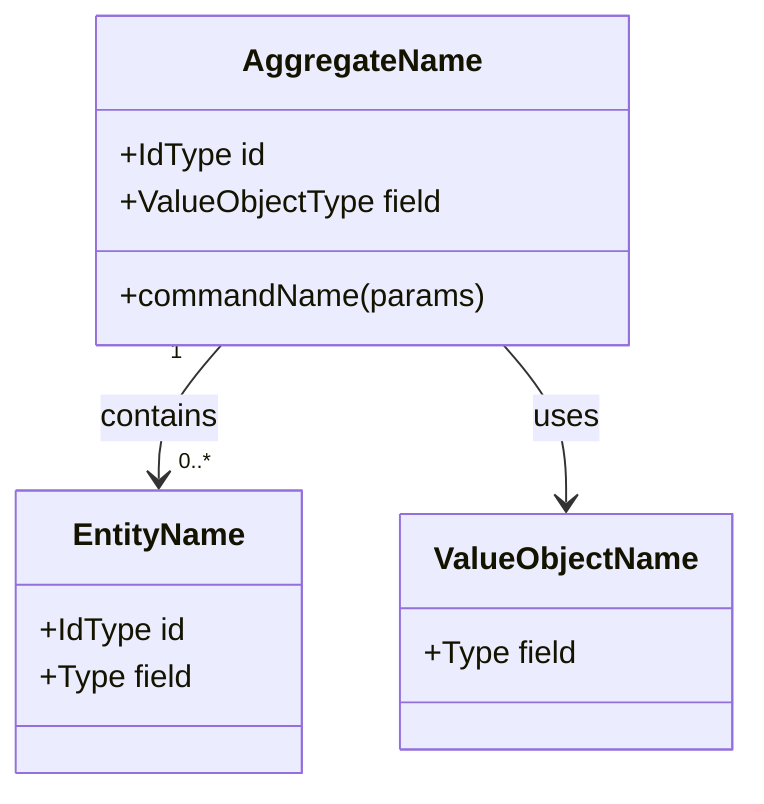
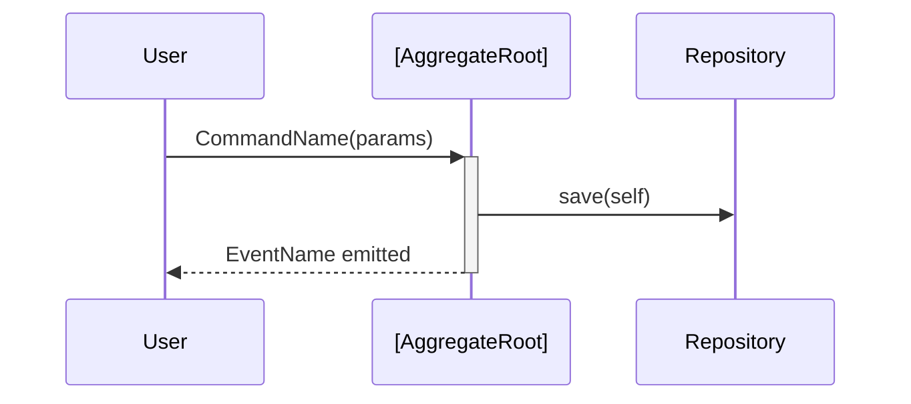

# Tactical DDD

Produces `tactical-ddd.md` — a visual tactical model — by drilling into the aggregates, entities, value objects, domain events, and repositories within each bounded context defined in `domain.md`.

## Flow

```
LOCATE DOMAIN MODEL → CONTEXT SELECTION → TACTICAL MODELING (per context)
  → GENERATE DIAGRAMS → APPEND TASKS → SAVE ARTIFACT
```

---

## Step 1: Locate domain model

Find `domain.md` under `teams/richi_and_lucag/exercise_one/`. Read it fully before proceeding.

- If found: summarise the bounded contexts in one sentence each, then ask: *"Which context do you want to model tactically first?"*
- If not found: stop and tell the user to run `/domain` first.

Also read `teams/richi_and_lucag/docs/tasks.md` if it exists — needed for the task append in Step 5.

---

## Step 2: Context selection

List the bounded contexts from `domain.md`. Ask the user to pick one to start with.

Work through **one context per session**. After completing a context, ask: *"Model another context or stop here?"*

---

## Step 3: Tactical modeling conversation

For the selected context, work through these layers **one at a time**:

### Layer A — Aggregates
The aggregates were named in `domain.md`. For each one:
1. *"What invariant does [AggregateName] enforce? What rule can never be broken?"*
2. *"What commands trigger state changes on [AggregateName]?"* (e.g., `MarkRefinancingEligible`, `RecordPayment`)
3. *"What domain events does [AggregateName] emit when something important happens?"* (e.g., `RefinancingEligibilityDetected`)

### Layer B — Entities and Value Objects
For each aggregate:
1. *"What are the child entities — things with identity that live inside [AggregateName]?"*
2. *"What are the value objects — immutable descriptors with no identity of their own?"* (e.g., `MoneyAmount`, `InterestRate`)
3. *"Which fields on [AggregateName] are value objects vs. primitives?"*

### Layer C — Repositories
1. *"How is [AggregateName] persisted and retrieved? What are the meaningful query patterns?"*
2. *"What is the repository interface — what methods does it expose?"*

### Layer D — Domain Services
1. *"Is there any domain logic that doesn't naturally belong to a single aggregate?"* (If yes, name it as a Domain Service.)

### Layer E — Key Sequences
1. *"Walk me through the most important flow in this context — step by step, from command to event."*

After each layer, synthesise what you've heard before moving to the next: *"So [AggregateName] enforces [invariant], handles [commands], and emits [events]. Does that capture it?"*

---

## Step 4: Generate diagrams

After completing all layers for a context, generate **two diagram types**:

### ASCII — Aggregate structure

```
┌─────────────────────────────────────┐
│  <<Aggregate Root>>                  │
│  [AggregateName]                     │
├─────────────────────────────────────┤
│  + id: [IdType]                      │
│  + [field]: [ValueObject/Type]       │
│  ...                                 │
├─────────────────────────────────────┤
│  Commands:                           │
│  + [CommandName]([params])           │
│  ...                                 │
├─────────────────────────────────────┤
│  Events emitted:                     │
│  ○ [EventName]                       │
│  ...                                 │
└─────────────────────────────────────┘
         │ contains
         ▼
┌─────────────────────────────────────┐
│  <<Entity>>                          │
│  [EntityName]                        │
├─────────────────────────────────────┤
│  + id: [IdType]                      │
│  + [field]: [ValueObject/Type]       │
└─────────────────────────────────────┘
```

### Mermaid — Class diagram



### Mermaid — Sequence diagram (key flow)



Render all diagrams inline in `tactical-ddd.md`.

---

## Step 5: Append tasks to docs/tasks.md

During modeling, capture any implementation tasks that surface (e.g., "build `MortgageRepository`", "implement `DetectRefinancingEligibility` domain service").

Append them to `teams/richi_and_lucag/docs/tasks.md` under the **Backlog** section with this header comment marking the batch:

```markdown
<!-- appended by /tactical-ddd YYYY-MM-DD — [ContextName] -->
- [ ] **[Title]** — [one-line description]
  - **Context**: Surfaced during tactical DDD modeling of [ContextName]
  - **Acceptance**: [observable definition of done]
  - **Priority**: Medium
  - **Source**: tactical-ddd / YYYY-MM-DD
```

If `docs/tasks.md` does not exist, tell the user to run `/capture` first to initialise it.

---

## Step 6: Save artifact

Save to the **same session folder** as the grounding `domain.md`:

```
exercise_one/YYYY-MM-DD-<scope-slug>/tactical-ddd.md
```

Tell the user the full path and how many tasks were appended.

---

## tactical-ddd.md template

```markdown
# Tactical DDD: [Bounded Context Name]

_Date: YYYY-MM-DD | Grounded in: [relative path to domain.md]_

---

## [AggregateName]

### Invariant

[The rule this aggregate enforces — one sentence.]

### Structure (ASCII)

[ASCII diagram]

### Class Diagram

[Mermaid classDiagram]

### Key Flow: [Flow Name]

[Mermaid sequenceDiagram]

### Repository Interface

```
interface [AggregateName]Repository {
  findById(id: [IdType]): [AggregateName] | null
  save(aggregate: [AggregateName]): void
  [additional query method]: [return type]
}
```

### Domain Services

[Any domain services in this context, or "None identified."]

---

[Repeat for each aggregate in the context]

## Open Modeling Questions

[Unresolved questions to carry into /worker or revisit in /domain.]

1. [Question]
```

---

## Facilitation principles

- **Propose, don't just ask.** "Based on the domain model, I'd expect an aggregate here called `MortgageAccount` — does that name feel right?"
- **Keep tactics connected to strategy.** If a decision in Layer A would contradict the ubiquitous language from `domain.md`, flag it immediately.
- **One aggregate at a time.** Complete all five layers before moving to the next aggregate.
- **Diagrams serve the team.** If a diagram is getting too complex (more than 5–6 entities), split it into sub-diagrams rather than compressing.
- **Tasks are a side effect.** Don't force tasks — only capture what naturally surfaces as an implementation need during modeling.
