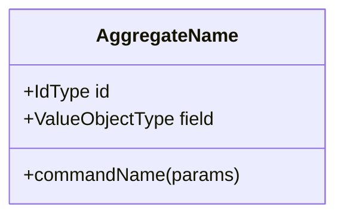
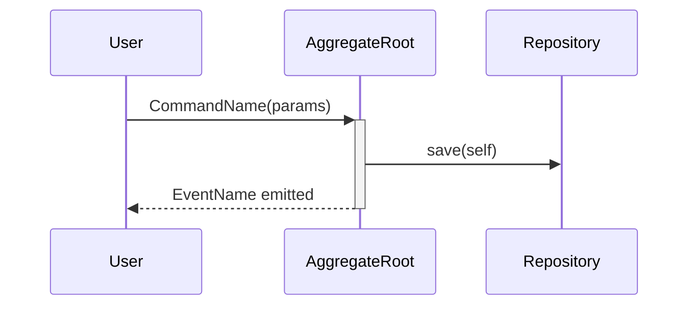

# Tactical DDD

Produces `tactical-ddd.md` — a visual tactical model — by drilling into the aggregates, entities, value objects, domain events, and repositories within each bounded context defined in `domain.md`.

## Memory Read Contract

Required reads on entry:
1. `memory/project/INDEX.md` — canonical pointers + session lifecycle.
2. `memory/task/state.md` — current phase, active session, blockers.
3. The active session's `domain.md` (resolved from INDEX). If absent, stop and tell the user to run `/domain` first.
4. `memory/project/glossary.md` — to keep tactical names aligned with accepted ubiquitous language.
5. `docs/tasks.md` — needed for the task append in Step 6.

Rules:
- Always resolve artifact paths through INDEX. Do not fuzzy-find via `find`.
- If INDEX is missing or points to a missing file, stop and tell the user to run `/reindex`. Do not silently fall back to globbing.
- The active session is whichever session has `status: active` in INDEX. Never use date-affinity heuristics.

## Flow

```
RESOLVE DOMAIN → CONTEXT SELECTION → TACTICAL MODELING (per context)
  → GENERATE DIAGRAMS → SAVE ARTIFACT → APPEND TASKS
```

Note: artifact save precedes task append. Persist the model first; the backlog is downstream.

---

## Step 1: Resolve domain model

Resolve the active session's `domain.md` via INDEX. Read it fully. Summarise the bounded contexts in one sentence each, then ask: *"Which context do you want to model tactically first?"*

---

## Step 2: Context selection

List the bounded contexts from `domain.md`. Ask the user to pick one to start with.

Work through **one context per session**. After completing a context, ask: *"Model another context or stop here?"*

---

## Step 3: Tactical modeling conversation

For the selected context, work through these layers **one at a time**:

### Layer A — Aggregates
The aggregates were named in `domain.md`. For each one:
1. *"What invariant does [AggregateName] enforce? What rule can never be broken?"*
2. *"What commands trigger state changes on [AggregateName]?"*
3. *"What domain events does [AggregateName] emit when something important happens?"*

### Layer B — Entities and Value Objects
For each aggregate:
1. *"What are the child entities — things with identity that live inside [AggregateName]?"*
2. *"What are the value objects — immutable descriptors with no identity of their own?"*
3. *"Which fields on [AggregateName] are value objects vs. primitives?"*

### Layer C — Repositories
1. *"How is [AggregateName] persisted and retrieved? What are the meaningful query patterns?"*
2. *"What is the repository interface — what methods does it expose?"*

### Layer D — Domain Services
1. *"Is there any domain logic that doesn't naturally belong to a single aggregate?"*

### Layer E — Key Sequences
1. *"Walk me through the most important flow in this context — step by step, from command to event."*

After each layer, synthesise what you've heard before moving to the next: *"So [AggregateName] enforces [invariant], handles [commands], and emits [events]. Does that capture it?"*

Cross-check every name against `memory/project/glossary.md`. Reuse accepted terms exactly. New or shifted terms become glossary proposals in Step 7.

---

## Step 4: Generate diagrams

After completing all layers for a context, generate **two diagram types** (ASCII aggregate structure + Mermaid class diagram), plus a Mermaid sequence diagram for the key flow. Render all diagrams inline in `tactical-ddd.md`. (Templates unchanged from prior version of this skill — see the artifact template at the bottom.)

---

## Step 5: Memory Write Transaction (artifact first)

Write order, no skipping:

1. Save `tactical-ddd.md` inside the active session folder resolved from INDEX:
   `<active-session-folder>/tactical-ddd.md`. If the file already exists for the active session, append a new context section rather than overwriting prior work.
2. Verify the file exists and is non-empty.
3. Update `memory/project/INDEX.md` — bump the `tactical-ddd` row in canonical artifacts. Refresh `Canonical artifact set complete` and `Last reindex` as appropriate.
4. Replace `memory/task/state.md` wholesale with the new snapshot (phase = post-tactical-ddd, next action = `/capture` to refine the surfaced tasks, or `/worker` to start implementation).
5. Run the Decision Gate. Append qualifying entries to `memory/project/decisions.md`.
6. Output any glossary candidates as a `## Glossary Proposals` section in the final response. Do not edit `glossary.md`.

If any step after step 1 fails or is skipped, the final response must say:
> Memory drift possible. Run `/reindex` to reconcile.

---

## Step 6: Append tasks to docs/tasks.md

Only after the artifact is safely saved. During modeling, capture any implementation tasks that surfaced (e.g., "build `OrderRepository`", "implement `DetectStaleSession` domain service").

Append them to `docs/tasks.md` under the **Backlog** section with this header comment marking the batch:

```markdown
<!-- appended by /tactical-ddd YYYY-MM-DD — [ContextName] -->
- [ ] **[Title]** — [one-line description]
  - **Context**: Surfaced during tactical DDD modeling of [ContextName]
  - **Acceptance**: [observable definition of done]
  - **Priority**: Medium
  - **Source**: tactical-ddd / YYYY-MM-DD
```

If `docs/tasks.md` does not exist, initialise it using the standard template in `/capture` before appending — do not punt to the user.

Tell the user the artifact path and how many tasks were appended.

---

## Step 7: Decision candidates

End the session with this block:

```
Decision candidates from this session:
1. [candidate] — append: yes/no — reason
2. [candidate] — append: yes/no — reason
```

Aggregate boundaries, repository contracts, and chosen invariants typically qualify. Ad-hoc method naming does not.

---

## tactical-ddd.md template

```markdown
# Tactical DDD: [Bounded Context Name]

_Date: YYYY-MM-DD | Grounded in: [relative path to domain.md]_

---

## [AggregateName]

### Invariant

[The rule this aggregate enforces — one sentence.]

### Structure (ASCII)

[ASCII aggregate diagram with fields, commands, and emitted events]

### Class Diagram



### Key Flow: [Flow Name]



### Repository Interface

```
interface [AggregateName]Repository {
  findById(id: [IdType]): [AggregateName] | null
  save(aggregate: [AggregateName]): void
}
```

### Domain Services

[Any domain services in this context, or "None identified."]

---

[Repeat for each aggregate in the context]

## Glossary Proposals

[Candidate terms emitted by this session, mirroring the response-level proposals.]

## Open Modeling Questions

1. [Question]
```

---

## Facilitation principles

- **Propose, don't just ask.** "Based on the domain model, I'd expect an aggregate here called `[ProposedName]` — does that name feel right?"
- **Keep tactics aligned with ubiquitous language.** A name that contradicts `glossary.md` is flagged immediately, not silently renamed.
- **One aggregate at a time.** Complete all five layers before moving to the next aggregate.
- **Diagrams serve the team.** If a diagram exceeds 5–6 entities, split into sub-diagrams.
- **Tasks are a side effect.** Capture only what naturally surfaces as an implementation need during modeling.
