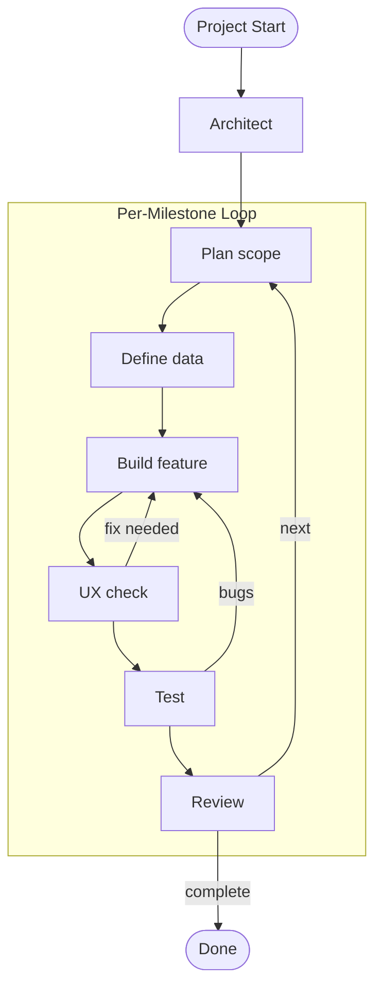

# Workflow — Snowball Finance App

Agentic workflow for building the app milestone by milestone. Six agents, five skills, one repeating loop.

---

## Agents

| Agent           | File                        | Core job                                      |
| --------------- | --------------------------- | --------------------------------------------- |
| Planner         | `agents/planner.md`         | Scope a milestone before work starts          |
| Architect       | `agents/architect.md`       | Bootstrap and maintain the project structure  |
| Data Modeller   | `agents/data-modeller.md`   | Define the IndexedDB schema before any UI     |
| Feature Builder | `agents/feature-builder.md` | Implement in-scope features                   |
| UX Auditor      | `agents/ux-auditor.md`      | Catch friction that breaks the 10-second rule |
| QA Smoke        | `agents/qa-smoke.md`        | Run acceptance tests; sign off or file bugs   |

## Skills

| Skill                | File                             | When to reach for it                            |
| -------------------- | -------------------------------- | ----------------------------------------------- |
| milestone-scope      | `skills/milestone-scope.md`      | Start of every milestone                        |
| schema-first         | `skills/schema-first.md`         | Before Feature Builder writes any code          |
| ux-10s-check         | `skills/ux-10s-check.md`         | After Feature Builder; before QA                |
| export-import-verify | `skills/export-import-verify.md` | After any schema change                         |
| simplify             | `skills/simplify.md`             | After milestone sign-off, before next milestone |

---

## Project Start (once)

```
Architect → scaffold project
  skill: schema-first (define Transaction type before any UI)
```

---

## Per-Milestone Loop (repeat for M1 → M6)

```
1. Planner
   skill: milestone-scope
   → scoped task list, agent sequence, acceptance test

2. Data Modeller
   skill: schema-first
   → TypeScript types + Dexie table definition

3. Feature Builder
   → working UI, all features wired to IndexedDB

4. UX Auditor
   skill: ux-10s-check
   → friction list; blockers must be fixed before QA

5. Feature Builder (if blockers found)
   → fix UX blockers

6. QA Smoke
   skill: export-import-verify (on any milestone touching data)
   → pass/fail checklist; explicit sign-off

7. Feature Builder (if QA fails)
   → fix bugs; QA re-runs only the failed items

8. Simplify
   skill: simplify
   → remove dead code before moving to next milestone
```

---

## Hard Rules

- **Planner runs before Feature Builder, always.** No code without a scoped task list.
- **Data Modeller runs before Feature Builder, always.** No UI before the schema is agreed.
- **UX Auditor clears blockers before QA.** QA does not run against a broken flow.
- **`pnpm dev` must work at every step.** A half-built feature that breaks the dev server is worse than no feature.
- **The 10-second rule is non-negotiable.** If a milestone leaves any core flow slower than 10 seconds, it is not done.

---

## Visual Representation



---

## Evaluation

### How it improves the work

The Planner + `milestone-scope` combination is the highest-leverage part. Forcing an explicit "in / out / acceptance test" before any code starts eliminates the biggest time sink in a workshop: building things nobody asked for. The Data Modeller running before Feature Builder avoids a common frontend mistake — designing UI before the data shape is stable, which usually leads to rework.

The UX Auditor enforces the 10-second rule as a hard constraint, preventing small UX regressions from accumulating across milestones. The QA loop, especially with `export-import-verify`, protects the only real persistence mechanism in the app, ensuring that data can always be restored.

Overall, the workflow encourages small, verifiable steps and keeps the app runnable at all times.

### Where it struggles

The feedback loops (UX Auditor → Feature Builder, QA → Feature Builder) depend heavily on prompt quality. Without concrete context (e.g. a running app or clear examples), the agents can produce vague or incorrect feedback.

The Simplify step is also easy to skip under time pressure, since it does not produce visible features, even though it prevents long-term complexity.

Finally, the workflow relies on the Planner getting the scope right early. A bad scope propagates through all agents, and there is no built-in correction until QA fails, which can make issues expensive to fix late.
